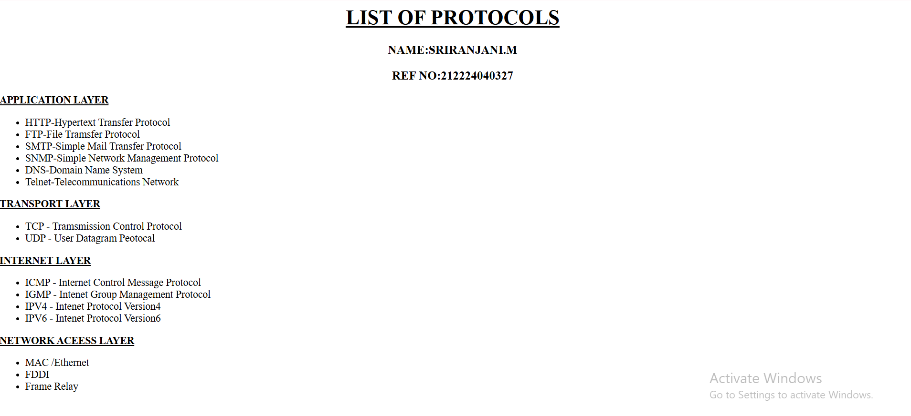

# EX01 Developing a Simple Webserver
## Date:01.05.2025

## AIM:
To develop a simple webserver to serve html pages and display the list of protocols in TCP/IP Protocol Suite.

## DESIGN STEPS:
### Step 1: 
HTML content creation.

### Step 2:
Design of webserver workflow.

### Step 3:
Implementation using Python code.

### Step 4:
Import the necessary modules.

### Step 5:
Define a custom request handler.

### Step 6:
Start an HTTP server on a specific port.

### Step 7:
Run the Python script to serve web pages.

### Step 8:
Serve the HTML pages.

### Step 9:
Start the server script and check for errors.

### Step 10:
Open a browser and navigate to http://127.0.0.1:8000 (or the assigned port).

## PROGRAM:
```
from http.server import HTTPServer, BaseHTTPRequestHandler
content ="""
    <html>
    <h1 align="center"><u>
          LIST OF PROTOCOLS
    </h1> </u>
    <h3 align="center">NAME:SRIRANJANI.M</h3>
    <h3 align="center">REF NO:212224040327</h3>
    <b><u><head>
         APPLICATION LAYER
    </b></u></head> 
    <ul>
    <li>HTTP-Hypertext Transfer Protocol</li>
    <li>FTP-File Tramsfer Protocol</li>
    <li>SMTP-Simple Mail Transfer Protocol</li>
    <li>SNMP-Simple Network Management Protocol</li>
    <li>DNS-Domain Name System</li>
    <li>Telnet-Telecommunications Network</li>
    </ul>

    <b><u><head>
         TRANSPORT LAYER
    </b></u></head> 
   <ul>
  <li>TCP - Tramsmission Control Protocol</li>
  <li>UDP - User Datagram Peotocal</li>
  </ul>
  <b><u><head>
      INTERNET LAYER
  </b></u></head> 
  <ul>
  <li>ICMP - Internet Control Message Protocol</li>
  <li>IGMP - Intenet Group Management Protocol</li>
 <li>IPV4 - Intenet Protocol Version4</li>
 <li>IPV6 - Intenet Protocol Version6</li>
 </ul>
 <b><u><head>
        NETWORK ACEESS LAYER
 </b></u></head> 
<ul>
<li> MAC /Ethernet</li>
<li>FDDI</li>
<li>Frame Relay</li>
</ul>
</html>
"""
class myhandler(BaseHTTPRequestHandler):
    def do_GET(self):
        print("request received")
        self.send_response(200)
        self.send_header('content-type', 'text/html; charset=utf-8')
        self.end_headers()
        self.wfile.write(content.encode())
server_address = ('',8000)
httpd = HTTPServer(server_address,myhandler)
print("my webserver is running...")
httpd.serve_forever()
```  
## OUTPUT:


.png>)

## RESULT:
The program for implementing simple webserver is executed successfully.
